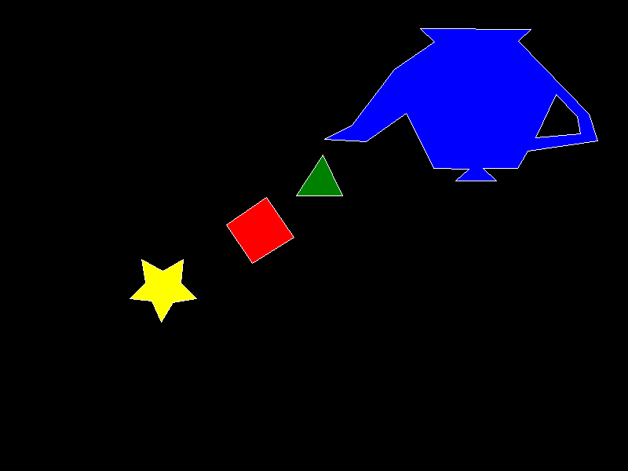

# Lab 1: Filling any polygon

## Algoritmos utilizados

### Bresenham

Cada polígono se construye uniendo sus vértices mediante el algoritmo de Bresenham. Este algoritmo permite dibujar líneas utilizando únicamente operaciones con números enteros, lo que lo hace eficiente y adecuado para generar el contorno de cada figura.

### Scanline Fill

Una vez dibujado el contorno, el polígono se rellena utilizando el algoritmo **Scanline Fill**.
Una scanline se puede definir como una linea horizontal

El procedimiento seguido es el siguiente:
1. Encontrar el valor mínimo y máximo de **Y** del polígono.
2. Recorrer cada línea horizontal (scanline) comprendida entre esos valores.
3. Calcular todas las intersecciones de la scanline con las aristas del polígono.
4. Ordenar las intersecciones de izquierda a derecha.
5. Rellenar los píxeles comprendidos entre cada par de intersecciones.

Finalmente, el contorno se vuelve a dibujar para mantener los bordes visibles sobre el relleno.

## Flujo del programa

El procedimiento seguido para cada polígono es:

```text
Definir los vértices
        │
        ▼
Dibujar el contorno (Bresenham)
        │
        ▼
Rellenar el interior (Scanline Fill)
        │
        ▼
Redibujar el contorno
```

## CASO ESPECIAL 
En el caso del polígono 5, este representa un agujero dentro del polígono 4. Para obtener el resultado esperado, se rellena utilizando el color del fondo y posteriormente se vuelve a dibujar su contorno.

## Estructura del proyecto

```text
src/
├── framebuffer.rs
├── line.rs
├── poligono.rs
└── main.rs
```

## Resultado



